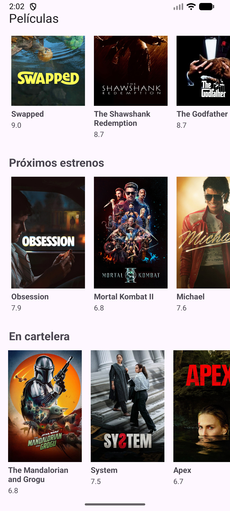
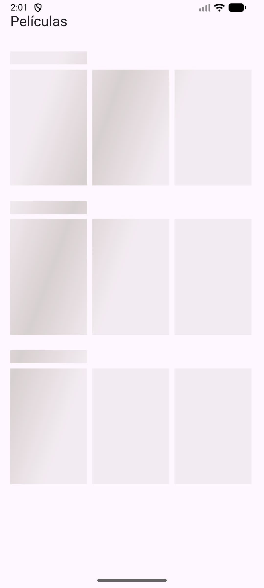
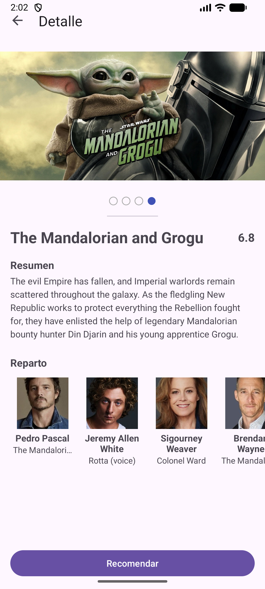
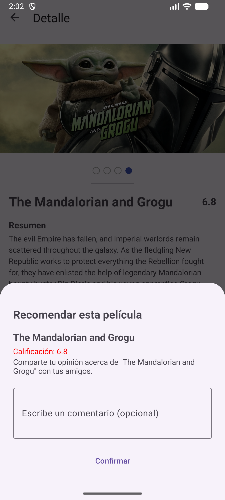
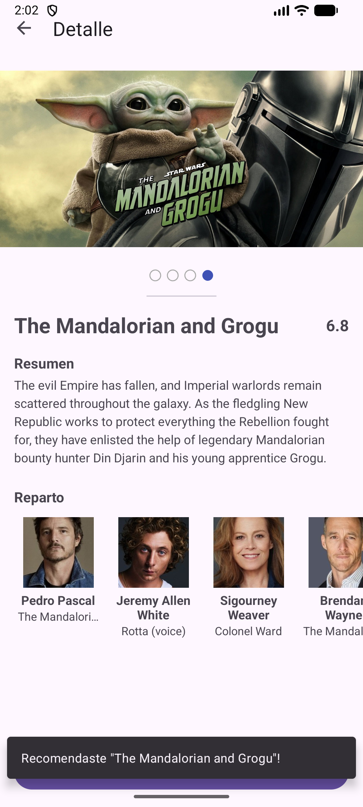

# IMDUMB - Android Movie Discovery Application 🎬

[](https://kotlinlang.org)
[]()
[]()
[]()

**IMDUMB** es un proyecto de reto técnico para desarrollo Android, creado con el objetivo de demostrar buenas prácticas de desarrollo moderno y principios de arquitectura a través de una aplicación de descubrimiento y recomendación de películas utilizando la API de The Movie Database (TMDb). El proyecto fue construido con un enfoque en escalabilidad, mantenibilidad, arquitectura limpia y testabilidad.

---

## 🚀 Resumen del Proyecto

La aplicación permite a los usuarios explorar el vasto catálogo de TMDb a través de una interfaz fluida y moderna.

*   **Propósito:** Servir como base técnica sólida para aplicaciones de consumo de contenido multimedia.
*   **Funcionalidades principales:**
    *   **Listado de categorías:** Exploración de películas populares, mejor calificadas, próximas y en cartelera.
    *   **Detalle de películas:** Información completa incluyendo sinopsis, géneros, fecha de lanzamiento y calificación.
    *   **Navegación robusta:** Flujo optimizado entre pantallas mediante Navigation Component.
    *   **Sistema de recomendación:** Implementación de un BottomSheet dinámico para recomendaciones.
    *   **Consumo de API:** Integración completa con TMDb API v3.

---

## 🏗️ Arquitectura del Proyecto

El proyecto implementa una arquitectura **MVP (Model-View-Presenter)** siguiendo los principios de **Clean Architecture**. Esta separación de responsabilidades garantiza que la lógica de negocio sea independiente de la interfaz de usuario y de las fuentes de datos externas.

### Flujo de Datos
```text
Presentation -> Domain -> Data
```

### Capas y Responsabilidades

#### 1. Presentation
Encargada de la interacción con el usuario y la renderización de la UI.
*   **Activity/Fragments:** Vistas pasivas que implementan interfaces de contrato.
*   **Presenters:** Orquestan la lógica de la vista y se comunican con los Use Cases.
*   **Contracts:** Interfaces que definen la comunicación entre la Vista y el Presenter.
*   **Adapters:** Manejo eficiente de listas mediante `RecyclerView`.

#### 2. Domain
Contiene la lógica de negocio pura. Es una capa puramente Kotlin/Java, sin dependencias de Android.
*   **UseCases:** Casos de uso específicos de la aplicación (e.g., `GetMovieDetailUseCase`).
*   **Repository Interfaces:** Contratos que definen cómo se deben obtener los datos.
*   **Domain Models:** Modelos de datos específicos para la lógica de negocio.

#### 3. Data
Responsable de la persistencia y recuperación de datos.
*   **Retrofit:** Cliente para consumo de servicios REST.
*   **Repository Implementations:** Implementaciones concretas de los contratos definidos en Domain.
*   **DTOs (Data Transfer Objects):** Modelos de datos que reflejan la respuesta de la API.
*   **Mappers:** Convierten DTOs en Modelos de Dominio.
*   **Remote Data Sources:** Abstracción de la fuente de datos externa.

---

## 🛠️ Tech Stack

| Tecnología | Versión | Descripción |
| :--- | :--- | :--- |
| **Kotlin** | 2.0.21 | Lenguaje de programación principal. |
| **Hilt** | 2.55 | Inyección de dependencias. |
| **RxJava2 / RxKotlin** | 2.2.21 / 2.4.0 | Programación reactiva para flujos asíncronos. |
| **Navigation Component**| 2.8.5 | Navegación entre pantallas y Safe Args. |
| **Retrofit / OkHttp** | 2.11.0 / 4.12.0 | Cliente HTTP y consumo de APIs. |
| **Glide** | 4.16.0 | Carga y caché de imágenes. |
| **Material Design** | 1.12.0 | Componentes de UI y diseño visual. |
| **ConstraintLayout** | 2.2.0 | Diseño de interfaces complejas y optimizadas. |
| **ViewPager2** | - | Implementación de carruseles de imágenes. |
| **Gson** | 2.11.0 | Serialización y deserialización de JSON. |

---

## 📸 Screenshots

A continuación se muestra la interfaz visual de la aplicación:

| Splash | Home | Loader |
| :---: | :---: | :---: |
|  |  |  |

| Detalle | Recomendación | Éxito |
| :---: | :---: | :---: |
|  |  |  |

---

## ⚙️ Cómo correr el proyecto

### Requisitos Técnicos
*   **Android Studio:** Ladybug (2024.2.1) o superior.
*   **Gradle:** 8.7.3
*   **Minimum SDK:** 24 (Android 7.0)
*   **Target SDK:** 36

### Pasos para la ejecución
1.  **Clonar el repositorio:** `git clone https://github.com/tu-usuario/IMDUMB.git`
2.  **Abrir el proyecto:** Importar en Android Studio.
3.  **Sync Gradle:** Dejar que Android Studio descargue las dependencias.
4.  **Seleccionar Build Variant:** Seleccionar `devDebug` o `prodDebug` desde la pestaña *Build Variants*.
5.  **Ejecutar:** Presionar el botón *Run* (Shift + F10).

---

## 🎭 Product Flavors

El proyecto utiliza **Product Flavors** para separar los entornos de desarrollo y producción:

*   **`dev`**: Utilizado para desarrollo local.
    *   `applicationIdSuffix`: `.dev`
    *   Configuración de `BASE_URL` apuntando a entornos de prueba.
*   **`prod`**: Versión lista para distribución.
    *   Sin sufijo en el ID de aplicación.
    *   Configuración de `BASE_URL` oficial de TMDb.

---

## 🔥 Firebase Integration

La aplicación utiliza la infraestructura de **Firebase** para configuraciones dinámicas:

*   **Firebase Remote Config:** Permite modificar el comportamiento y la apariencia de la app sin publicar una nueva versión.
*   **Configuración:** Requiere el archivo `google-services.json` en la carpeta `app/`.
*   **Compatibilidad:** Se han registrado aplicaciones separadas en Firebase para manejar ambos flavors:
    *   `com.jquiroga.imdumb` (Prod)
    *   `com.jquiroga.imdumb.dev` (Dev)

---

## 🔌 Endpoints Utilizados (TMDb)

La aplicación consume los siguientes servicios de **TMDb API**:

### 1. Categorías de Películas
`GET /movie/{category}`
Obtiene listados de películas según su estado: *Popular, Top Rated, Upcoming* y *Now Playing*.

### 2. Detalle de Película
`GET /movie/{movie_id}`
Retorna información detallada: título, sinopsis, calificación, imagen de fondo, fecha de lanzamiento y géneros.

### 3. Créditos
`GET /movie/{movie_id}/credits`
Obtiene el reparto principal y el equipo de producción de la película.

### 4. Imágenes
`GET /movie/{movie_id}/images`
Recupera posters y backdrops utilizados en el `ViewPager2` de la pantalla de detalle.

---

## 🧩 SOLID Principles & Clean Code

El proyecto aplica rigurosamente los principios **SOLID**:

*   **Single Responsibility (SRP):** Cada clase tiene una única razón para cambiar. Los Presenters solo manejan la lógica de presentación, mientras que los UseCases se encargan de la lógica de negocio.
*   **Open/Closed:** El sistema está abierto a la extensión pero cerrado a la modificación mediante el uso de interfaces.
*   **Liskov Substitution:** Las implementaciones de los repositorios pueden ser intercambiadas sin afectar a los consumidores (Domain layer).
*   **Interface Segregation:** Uso de interfaces de Contrato específicas para cada pantalla.
*   **Dependency Inversion:** Se depende de abstracciones (interfaces de Repositorio) en lugar de implementaciones concretas. **Hilt** facilita este desacoplamiento.

---

## 🗺️ Navigation & Architecture

*   **Single Activity Architecture:** El proyecto utiliza una única `MainActivity` que actúa como contenedor.
*   **Navigation Component:** Gestión centralizada de fragmentos mediante un gráfico de navegación.
*   **Safe Args:** Paso de parámetros entre pantallas de forma segura y tipada.
*   **Shared UI:** La `Toolbar` se gestiona a nivel de `MainActivity` para mantener consistencia visual.

---

## 🧪 Testing

Actualmente, el proyecto se enfoca en la calidad de la **Capa de Dominio**.

*   **Unit Tests:** Implementados para todos los `UseCases`.
*   **Tecnologías:** Mockito para mockear dependencias y RxJava Testing para validar flujos reactivos.
*   **Estándar:** Se utiliza el patrón **GIVEN / WHEN / THEN** para una mayor legibilidad y claridad en las pruebas.
*   **Validación:** Se asegura que la lógica de negocio sea correcta antes de llegar a la capa de presentación.

---

*Desarrollado por [Jamer Quiroga](https://github.com/jamerquiroga)*
